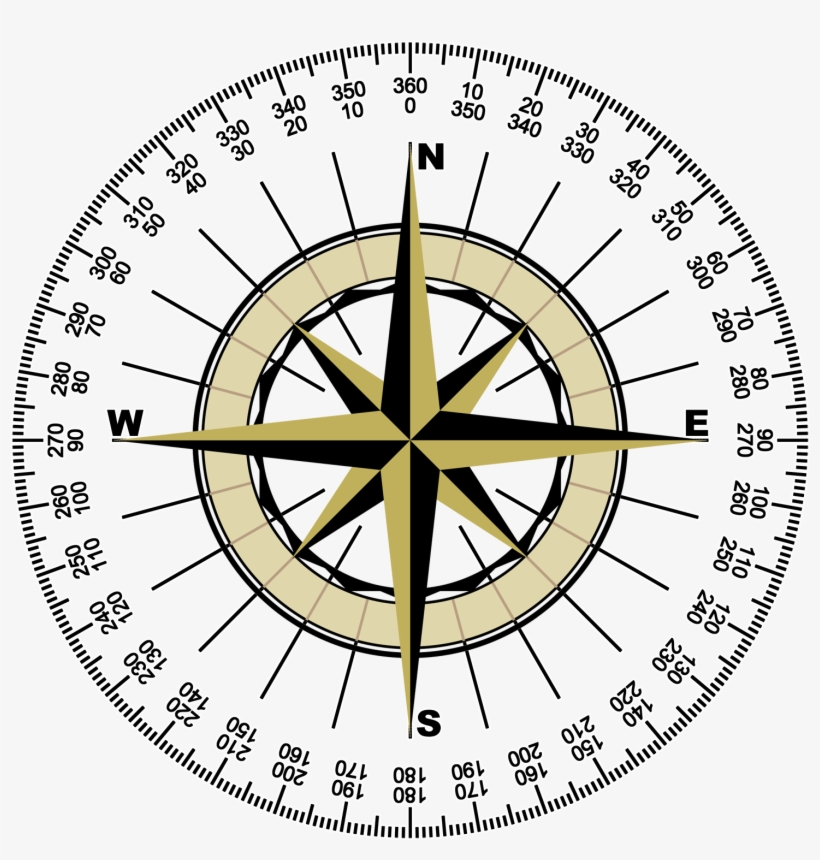

# COSC 301 Project Group 29

## Introduction

---

## Exploratory Data Analysis

---

## Question 1 + Results

## Question 2 + Results
 ### We would like to analyze average wind speeds and direction to determine if renewable wind turbine energy would be effective and sustainable in the region where this data is collected. Reason for this question is to see if this particular renewable energy would be worth to try in this region to combat climate change and move away from fossil fuels. Inaddition, if wind turbines where installed, what direction should they face for maximize efficiency? What months would we see the most output and least?  Rainfall will also be examined to determine if this would be detrimental to the operation of any erected wind turbines.

---

### **Figure 7** 

*First I'd like to investigate what the variance of windspeeds are by month. Here we see that the highest average windspeeds are in the months November, December, January, and February between 2009-2022. The highest recorded average windspeed was above 25 mph; more than sufficient for a wind turbine to begin turning and generating electricity (minimum of ~7mph-9 mph Hydroquebec.com and eia.gov (US Energy Info Admin). The month that experienced the lowest average windspeeds are the months June -September. However, we also see the distribution of the data is skewed towards the lower end of the the plot with the greatest concentration around only ~4mph. To make this clearer, I decided an additional plot is needed to create a plot with distribution of the data as the focus.*

---

### **Figure 8** 

*Shown in purple, the distribution curve of averages from the same data used above confirms that it is as expected... the greatest distribution is below ~4mph. This may be detrimental to establishing wind turbines in this area as the minimum speed to generate electricity is ~7mph-9mph as stated previously. There appears to be some data indicating speeds of up to ~28 mph but those are clearer outliers. However, lets look at the mean of all the averages over the month over the data collection years (or in other words, averages of the averages of the months).
Shown in green, this distribution curve looks a lot more promising! Here we can see that although the greatest density of recorded average windspeed is still ~4mph, we see that there is a second peak of distributions around ~8mph... sufficient to run a wind turbine.*

---

### **Figure 9**

*I was interested in what directions wind turbines should face if installed in the area. This is because there are two types of horizontal axis wind turbines: Upwind turbines that face into the wind (more common), and downwind turbines (rarer). To achieve optimal conditions, the rotor should be perpendicular to the wind direction(dtu.dk),  Here we see that the first cluster of wind direction come from heads between ~225 degrees to ~300 degrees. The second cluster we see (although significantly less prevalent that the first cluster) is at group between ~50 degrees to 125 degrees. The largest count from a wind direction is at ~285 degrees, while the least wind came from a ~165 degree direction. From these headings and the below compass image for reference, we can determine infer that the most of the wind comes from a westward direction blowing through to the east.*

---

### **Figure 10**

*Here I'm looking to see in which months the most rainfall is received to determine if this would impact wind turbine effectiveness.This is important because rain can be detrimental to wind turbines as it can cause greater wear & tear on the turbine blades which would require costly repairs and replacements (https://link.springer.com/article/10.1007/s40735-021-00472-0). If high winds and rainfall are are seen in similar months then that could hinder the operation of wind turbines. Fortunately, it seems the most rainfall is in the months May and July with all averages all below ~1 in of rain for every month. However, it appears there are some instances rainfall is beyond ~1in, most notably in April thru August with August having experienced up to ~4.25in of rain. Luckily these months are  almost opposite of what we see from when wind speeds are highest and therefore should not affect wind turbine operations in conjunction. For reference, Kelowna received ~2.97 inches of rain in June 2022, the highest of all months this year (https://kelowna.weatherstats.ca/).*

## Question 3 + Results

---

## Conclusion

*From Fig. 7 and Fig. 8 we can conclude that the average windspeed of ~8mph by month experienced by Estes Park is sufficent to sustain wind turbines. However, we acknowledge that the average may not justify the costs of installation and operations of wind turbines as the output would be only minimal. From Fig. 9 it was observed that the wind direction came mainly from a westward direction and therefore if wind turbines were installed, they should be facing west for optimal energy production. Fig. 10 shows that rainfall in the region is not relatively high to Kelowna and that most rainfall were in months outside of when average windspeed was highest and therefore would not interfere with wind turbine operation. In conclusion, as the world experiences increasing global climate change from fossil fuels and other other non-renewable energy sources, Etes Park, Colorado *may* benefit from hosting wind turbines to supplement their current hydroelectricity and perhaps sell surplus energy to other regions to combat climate change.*