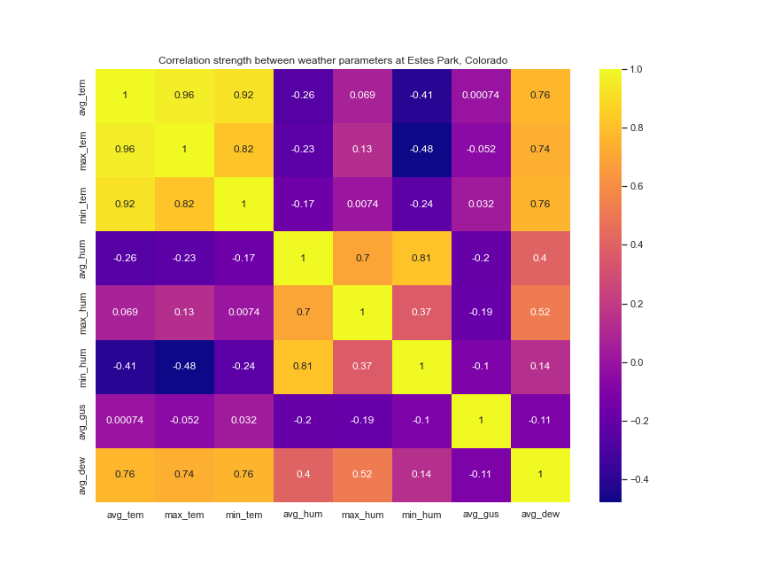
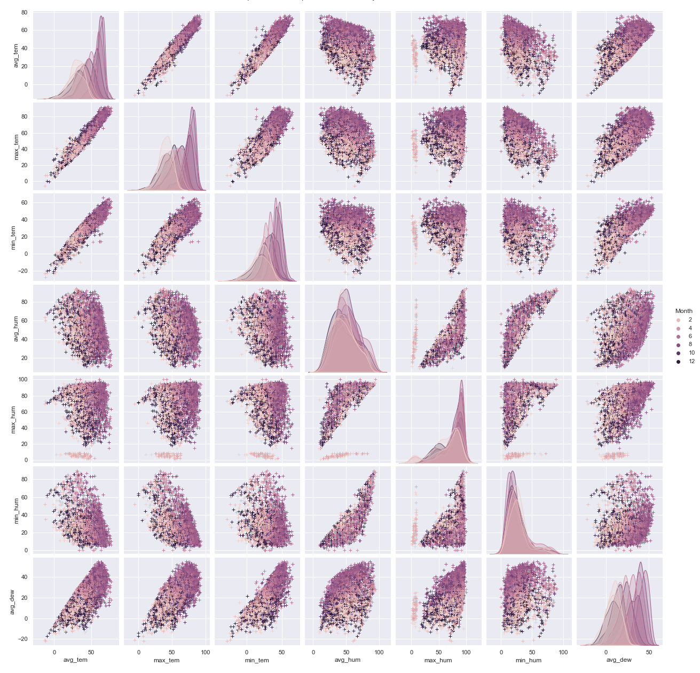
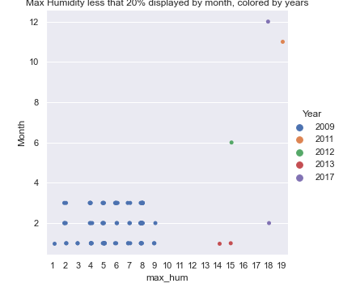
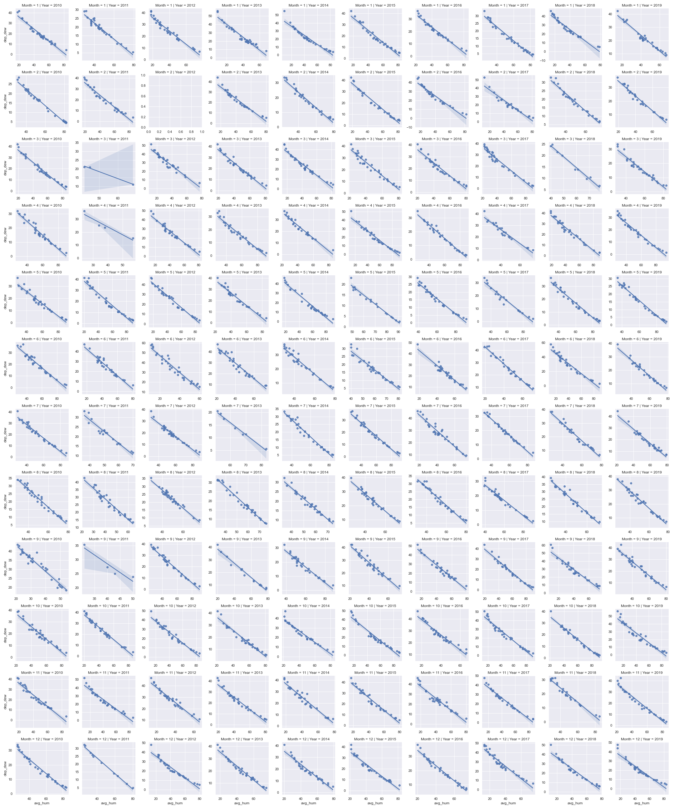
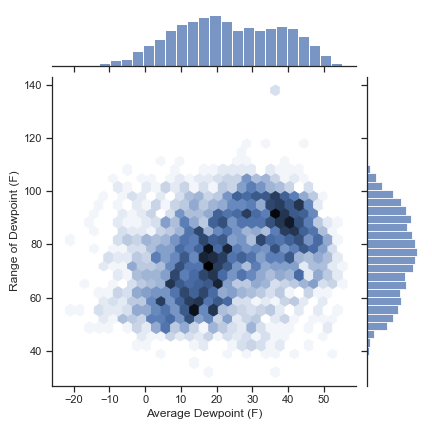
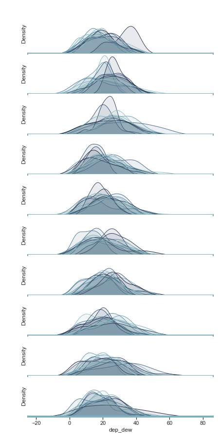

# COSC 301 Project Group 29

## Introduction

---

## Exploratory Data Analysis

Note that this data is from Estes Park, Colorado. So temperature higher in from June to August (summer) and lower in December to Feburary (winter). Dewpoint is strongly related to temperature and humidity according to NOAA's National Weather Services' definition. So I will focus on these values first.

Reading from humidity values, we found that five number summary of avergae humidites are 9, 36, 47,61 and 94 percents, with maximum humidity median around 81 and miminum humidity median around 32, the data suggests that the park is relatively dry over the year. And maximum rainfall per minute is 0 throughout the year would suggest the same thing.

Now if we read from average temperature, five number summary of it is -12.1, 33.7, 45.1, 58.0, 76.3 F. and maximum of temperature only 92.7 suggests that the park is relatively cold through out the year.

Average dewpoint readings are -22.200, 12.100, 22.500, 35.4000, and 55.100, all approximately 10 F below temperature readings with the highest difference at about 20 F at lower quartile. It is unlikely for it to happen in winter when the temperature is lowest, I assume that there is a humidity drop with respect to temperature before or after winter.

By how the dewpoints are defined, humidity and temperature are relevent to dewpoints. So as intended, the standard deviation of those three are very close: 14.634088, 15.326793, and 17.438153 respectively. It is very interesting though, reading from the standard deviations from the average gustspeed, it is 14.117446, which is even closer to dewpoint's std.

I want to study if dewpoint are changing more drastically over years and see if there are explanations for it. So I will leave out less relevant datas from now on and keep average gustspeed in just in case for reasons mentioned above.

Now, I will start with more visualizations to get better understandings of this dataset. Start with plotting the correlation strength between weather parameters.

Correlations between temperature data and average dewpoint are 0.76 0.74 0.76, slighly higher than the correlations between humidity data and average dewpoint which are 0.4 0.52 0.14. It suggests that temperatures and humidities are all positively correlated to average dewpoints with temperatures having a stronger bond.

Humidity in general have a weak negative correlation to temperature. As they all map to values of value from 0.13 to -0.48. This discripancy between the first and second observation might come as a result of season changinng.

Average gustspeed, though has a similar standard deviation to average dewpoint, it merely has a similar flucation level. The correlation strength of it is very close to 0 for all cases with absolute value peaksed at 0.19, suggesting that this is an irrelevant variable in this analysis. I will leave it out from now on.

Temperatures are in degree fahrenheit, humidity is in %

Reading from the diagonal, from top left to bottom right, we can see that temperatures first. They are changing over month, the distributions are all very close to normal distribution in each month. The minimum and maximum are all relatively close to average. In Feburary, teperature are centered around 25 F, in June, temperautre peaks at around 60 F. In December, temperature falls back to around 25 F. On the other hand, the reading on humidity are very different. Humidity distributions are relatively close to each other over different months. Average humidity is close to normal distribution with mode close to 50. Max humidity is left skewed with mode aroound 90. Min humidity is right skewed with mode around 20. 

With the information above, we can tell roughly how weather is in Estes Park, Colorado: in a single day, temperature is relatively consistent. In different months, temperature would be higher at summer at around 60 F and around 25 F at winter. Humidity would normally peak around 90 and gets as low as 20 in all days.

The findings are consistent with the pair wise graph for average humidity and average temperature at the row 4 column 1. In June (summer) the readings of temperature are high at around 60 F and in December (winter) the readings of temperature are lowat around 20F. In all month, humidity readings distributes most closely at the middle at around 50 and spreads evenly to 0 and 100.

Reading from avgerate dewpoints, we can see that it gets higher in summer at around 30 F and lower at winter at around 10 F. Distribution changes along season like temperature does. The size of one standard deviations are very close to each other over different months, this is similar to the behavior average humidity (whereas it is different for temperature).

One concerning finding is that in the graphs related to maximum humidity, the values falls below 10 only in Feburary for a small group of data. I am assuming it is either due to recording error, or there was a severe weather took place one year during 2008 to 2020 at the park. I will look into this.

I first filtered out all the rows where max humidty comes below 20% as mentioned above. Next I plot them in a catplot where x axis is humidity, y axis is month, colored by year to see two things: 
- In which of the years is it happening?
- In which of the months is it happening?

So that I can see if it if is happening yearly, or it may just be misrecorded data.

We can see a huge group by blue dots at the bottom left corner. This means most of the "outliers" happens in 2009. As the quantity of data is distributed in a huge amount and spread evenly from 1 to 9 % in humidity and January to December in month. Additionally, max humidity below 10 is only happening for 2009 alone. I suspect this is falsely recorded data.

If we count among the days where max_humdity falls below 20% to see if max humidity goes less than min humidity, 2009 shows up alone. As max humidity going below min humidity is impossible the values are outliers. For easier analysis of the data set, I will remove data in 2009 entirely to get rid of the outliers.

---

## Question 1 + Results

Concerned for weather changes, I picked a data set which records weather statistics from Estes Park, Colorado over ten years. I will attempt to spot the existence and regularity of worrying climate changes on dew point by investigating possible drastic changes of dewpoint and dewpoint depressions over ten years and try to explain why they are happening.

### Fig 1

This plot describes the Pair Wise Relationship between Dewpoint Depression and Average Humidity each Month at Estes Park, Colorado from 2010 to 2020. Columns are for average humidity in %, and rows are for dewpoint depression in F.

All the plots have approximately the same linear approximation expcept for are a few expecial cases. Month 3 from 2011, Month 4 from 2011, Month 9 from 2011, and Month 2 from 2012 simply does not have sufficient (less than 5) data collected to support meaningful analysis. In all other month, averge dewpoint depression range from around 0 F to 40 F, and average humidity ranges from around 20% to 80%. 

All the distributions evenly spread along a staight line, suggesting the two variables have a netaive linear correlation. They have approximately the same x intercept and y intercept, suggesting average humidity and dewpoint depressions remains the roughly the same behavior over different year.

Hence, when humidity is low, the dewpoint depression gets high, then more cooling is needed to reach saturation, and the air becomes drier. In a park, it may mean its trees are easier to catch fire. 

### Fig 2

This plot focus on the display bivariate and univariate relationships of Average Dewpoints (F) (column) and Range of Dewpoints (F) (row) at Estes Park, Colorado from 2010 to 2020.

Averge Dewpoint is very close to normal distributino with center at around 20 F and one standard deviation around 15 F. Range of Dewpoint is also very close to normal distribution with center at around 80 F and one standard deviation around 10 F.

There are two clusters in the graph. One is where average dewpoint is around 10 to 20 F, dewpoint range is around 50 to 80F, the other is one is where verage dewpoint is around 30 to 40 F and dewpoint range is around 80 to 100. From the observation of average dewpoint changes over month, we can see that the bottom left cluster happens during winter, and the top right corner happens during summer.

Generally, higher average dewpoint correspond to higher range of dewpoint, and higher range of dewpoints show up in summer more than it does in winter. This is signifcant because a high range of of dewpoint may correspond to a sharp change of dewpoint. As Fig 1 we conclude that humidity ranges doesn't change much over the year, it correspond to a possiblity of sharp change in dewpoint yet a small change in temperature, in which case the place become what is called a dewpoint front which tightly connects to severe cimate.

### Fig 3

The last plot describes Dewpoint Depressions Variations by Year at Estes Park, Colorado. 

The plot provides ridgeline plot on dewpoint depression, rows for years (2010-2019 top to bottom), columns for dewpoint depression (-20 to 80 F left to right). Ridgeline hue for Month (January Lightest, December Darkest).

Here are the things noticable:

2010's summer has a very high dewpoint depression cluster at around 40, which correspond to a relative low of humidity in June the entire month. May 2012 and March 2018 has peaked at around 70. It is interesting though, highest dewpoint depression in other years shows up in December.

Looking over the dewpoint depression range, 2016 shows up to be the year with the lowest range of dewpoint depression, about 0 to 60 F. Its range is approximately 20 F less that others. Also in this year, distributions of dewpoint depressions of different month are overlapping each other. A low range change, and similar distribution of dewpoint depression throughout, suggests that 2016 is a year with least driness fluction year. It should be more pleasant than other years at the park.

### Results

At Estes Park, Colorado, dewpoint depression has a negative correlation with average humidity. During any time of the year, days with lower average humidity, air need to release more heat to reach saturation and are therefore catch fire more easily.

Average Dewpoint and range of dewpoint clusters at summer and winter at two differnt points, generally, they have a positive correlation. As average dewpoints at summer are generally higher, so is range of dewpoints. Hence, in summers at the Park, it is more like to experience drastic change in dewpoint to become dewpoint front, where severe weather could happen.

With most moderate dewpoint depression range and change, 2016 is, after analysis, the most pleasant year at the Park from 2010 to 2020.

## Question 2 + Results

## Question 3 + Results

---

## Conclusion